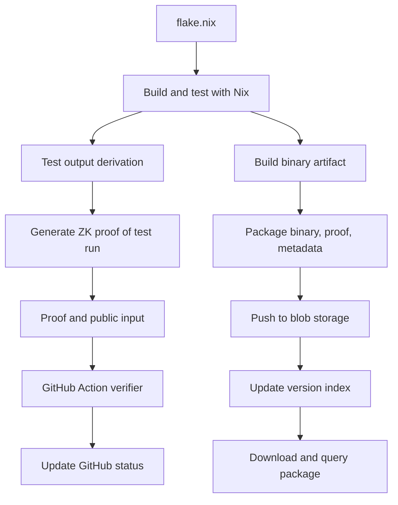

### Phase 1: Isolate and Build Rust Tests via Nix

* Fork Crane and strip to Rust-specific logic
* Ensure all builds and test outputs are derivations (isolated, reproducible)
* Output derivations for:

  * Build artifacts
  * Test results

### Phase 2: Generate Zero-Knowledge Proof from Test Output

* Design what statement to prove: "These tests ran successfully on this source"
* Export test logs, hashes, or traces as structured output from the Nix derivation
* Build a proof system (e.g., Circom/Halo2-based) that consumes test output
* Output:

  * `.proof` file
  * `public.json` with public inputs for verification

### Phase 3: GitHub Integration (Proof-Only CI)

* Build a GitHub Action or GitHub App that:

  * Downloads `.proof` and `public.json` from known location
  * Runs ZK verifier
  * Updates GitHub commit status (checks API)

### Phase 4: Local Artifact Builder

* Create a CLI that:

  * Accepts a flake input
  * Builds outputs via Nix
  * Runs tests
  * Generates proof
  * Packages binary + `.proof` + `public.json` + metadata

### Phase 5: Push to Versioned Blob Store

* Define upload structure:

  * `/pkgs/<flake-ref>/<hash>/binary`
  * `/pkgs/<flake-ref>/<hash>/test.proof`
  * `/pkgs/<flake-ref>/<hash>/metadata.json`
* Use an S3-compatible API for pushing artifacts
* Attach optional tags or metadata for lookup

### Phase 6: Registry and Retrieval

* Create a manifest or lightweight registry:

  * Index artifacts by flake ref or logical package name
  * Allow lookup by version, commit hash, or proof ID
* Build a downloader CLI or HTTP API that:

  * Pulls artifact
  * Verifies attached `.proof` locally
  * Extracts metadata and shows provenance

This breakdown preserves strict modularity. Each component can be tested independently. Most early development (Phases 1–3) can be entirely local and Git-based. No central service is required until Phase 5 (artifact hosting). Let me know if you'd like this in Markdown format for direct use in a repo or planning tool.
